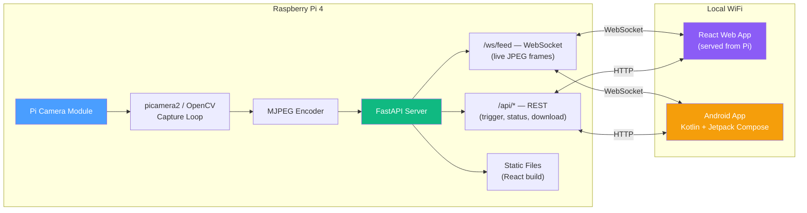

# TRC Photo Booth — Architecture & Prototype Roadmap

## 1. System Overview

A local-WiFi photo booth system where a **Raspberry Pi 4** captures live camera
feed, serves it over a **self-hosted web server**, and clients (React web app /
Kotlin Android app) connect to preview, trigger captures, apply filters, and
download photos/GIFs.



---

## 2. Key Architecture Decisions

### 2.1 Filters: Client-Side (Recommended ✅)

| Factor | On Pi | On Client |
|---|---|---|
| **Pi CPU load** | ❌ High — ARM Cortex-A72 struggles with real-time OpenCV filters at 30fps | ✅ Minimal — Pi just captures and streams raw frames |
| **Latency** | ❌ Adds 20-80ms per frame for processing | ✅ Instant — CSS/Canvas/GPU filters are <1ms |
| **Filter variety** | Limited by Pi's power | Web: CSS `filter()` + Canvas API are very powerful. Android: GPUImage / RenderScript |
| **Preview vs Capture** | Filters baked into stream — everyone sees the same | ✅ Each client picks their own filter; filter applied on capture trigger |
| **Bandwidth** | Same (JPEG either way) | Same |
| **Flexibility** | Hard to add new filters (redeploy Pi code) | ✅ Easy — just CSS/JS changes or app update |

> [!TIP]
> **Recommendation**: The Pi streams **raw frames only**. Clients apply filters
> locally for live preview. When a capture is triggered, the client sends the
> desired filter ID to the Pi, which either:
> - **(a)** Sends the raw high-res frame back, and the client applies the filter
>   before saving (simpler, recommended for prototype), or
> - **(b)** Applies the filter server-side on the high-res capture only (not
>   every preview frame) — viable since it's a one-shot operation, not 30fps.
>
> **For the prototype, go with (a).**

### 2.2 Streaming Protocol: WebSocket with JPEG Frames

| Protocol | Pros | Cons |
|---|---|---|
| **MJPEG over HTTP** | Dead simple, works in `` tags | One-way only, no control channel, no frame metadata |
| **WebSocket + JPEG** ✅ | Bidirectional, can send commands back, frame metadata (timestamp, index), works on Android easily | Slightly more code than MJPEG |
| **WebRTC** | Lowest latency, hardware-accelerated | Overkill for LAN, complex STUN/TURN setup, hard on Pi |
| **HLS/DASH** | Adaptive bitrate | 5-30s latency — unusable for live preview |

> [!IMPORTANT]
> **Decision**: WebSocket streaming of JPEG frames. Each WebSocket message is a
> binary JPEG blob (preview quality: 640×480, ~70% quality, ~30-50KB/frame).
> At 15fps to 2-5 clients, that's ~2-4 MB/s — well within Pi's WiFi capacity.

### 2.3 Web Server on the Pi Itself

Since the Pi is the only device with the camera, running the server on it
eliminates a hop. FastAPI (Python, async) is ideal:
- Same language as the camera capture code (Python)
- Async WebSocket support out of the box
- Serves the React build as static files (no separate web server needed)
- REST endpoints for trigger/config/download

### 2.4 Storage & Sharing

Photos and GIFs are generated on the Pi (temporary storage in `/tmp` or
RAM-backed tmpfs), then **pushed to connected clients via WebSocket** for
immediate save/share. No persistent gallery on the Pi for the prototype.

---

## 3. Tech Stack (Final)

| Component | Technology | Rationale |
|---|---|---|
| **Pi — Camera** | `picamera2` (official Pi camera library) | Direct hardware access, zero-copy buffers, better than OpenCV's `VideoCapture` for Pi Camera Module |
| **Pi — Server** | `FastAPI` + `uvicorn` | Async Python, WebSocket support, auto-generated API docs, same language as camera code |
| **Pi — Image Processing** | `Pillow` (PIL) for captures, `imageio` for GIF assembly | Lighter than OpenCV for the operations we need (resize, encode, GIF). OpenCV only if we add server-side filters later |
| **Pi — OS** | Raspberry Pi OS (64-bit, Bookworm) | Best hardware support for picamera2 |
| **Web — Framework** | React 18+ with TypeScript | Your choice, solid for this use case |
| **Web — Styling** | Vanilla CSS (with CSS custom properties) | Per project guidelines |
| **Web — Filters** | CSS `filter()` for preview + HTML Canvas for capture-time baking | Zero-dependency, GPU-accelerated, instant |
| **Web — Build** | Vite | Fast builds, output served as static files from Pi |
| **Android — Language** | Kotlin | Your choice |
| **Android — UI** | Jetpack Compose | Modern, declarative |
| **Android — WebSocket** | OkHttp WebSocket | Battle-tested, lightweight |
| **Android — Filters** | `android.graphics.ColorMatrix` / GPUImage | Hardware-accelerated |
| **Android — Image** | Coil (image loading) | Compose-native, efficient |

> [!NOTE]
> **Why `picamera2` over OpenCV?** OpenCV's `VideoCapture` on Pi uses V4L2
> under the hood, which works but loses access to Pi-specific features
> (hardware JPEG encoding, direct buffer access, camera controls). `picamera2`
> wraps `libcamera` — the official Pi camera stack — giving better performance
> and control. We can still use OpenCV/Pillow for image manipulation alongside
> `picamera2`.

---

## 4. API Design

### 4.1 WebSocket: `/ws/feed`

Bidirectional WebSocket carrying both video frames and control messages.

**Server → Client (Binary):** Raw JPEG frame bytes (preview quality)

**Server → Client (Text/JSON):**
```json
{ "type": "capture_result", "id": "abc123", "format": "jpeg", "url": "/api/captures/abc123.jpg" }
{ "type": "gif_result", "id": "abc123", "format": "gif", "url": "/api/captures/abc123.gif" }
{ "type": "status", "fps": 15, "clients": 3, "resolution": "640x480" }
{ "type": "error", "message": "Camera disconnected" }
```

**Client → Server (Text/JSON):**
```json
{ "type": "trigger_capture", "resolution": "full" }
{ "type": "trigger_gif", "frames": 8, "interval_ms": 200 }
{ "type": "set_preview", "fps": 15, "quality": 70, "resolution": "640x480" }
{ "type": "countdown", "seconds": 3 }
```

### 4.2 REST Endpoints

| Method | Path | Description |
|---|---|---|
| `GET` | `/api/status` | Camera status, connected clients, current settings |
| `POST` | `/api/capture` | Trigger a capture (alternative to WebSocket command) |
| `POST` | `/api/gif` | Trigger a GIF capture |
| `GET` | `/api/captures/:id` | Download a specific capture (JPEG or GIF) |
| `GET` | `/api/captures` | List recent captures (last N, in-memory) |
| `DELETE` | `/api/captures/:id` | Remove a capture |
| `POST` | `/api/settings` | Update camera settings (brightness, contrast, etc.) |
| `GET` | `/` | Serve React web app (static files) |

---

## 5. Project Structure (Monorepo)

```
trc-photobooth/
├── roadmap.md                  # Prototype roadmap & architecture spec
├── .gitignore                  # Monorepo git ignore rules
│
├── pi/                         # Raspberry Pi: Camera capture & FastAPI WebSocket server
│   ├── pyproject.toml          # Package spec & dependencies
│   ├── requirements.txt        # Frozen Python dependencies
│   ├── README.md               # Pi server docs & hardware setup
│   ├── src/
│   │   ├── main.py             # FastAPI app entry point, lifespan, static file serving
│   │   ├── camera.py           # Camera manager (picamera2 + MockCamera fallback)
│   │   ├── streamer.py         # WebSocket streaming hub (fan-out & backpressure)
│   │   ├── models.py           # Pydantic models for status & messages
│   │   ├── config.py           # Settings with env variable overrides
│   │   ├── routes/
│   │   │   ├── ws.py           # /ws/feed WebSocket endpoint
│   │   │   ├── api.py          # /api/status, /api/health, /api/config, /api/snapshot
│   │   │   └── __init__.py
│   │   └── static/
│   │       └── index.html      # Phase 1 live feed monitor & HUD (also /test.html)
│   ├── tests/
│   │   ├── test_camera_mock.py # Camera capture & JPEG encoding unit tests
│   │   └── test_api.py         # API routes & WebSocket streaming tests
│   └── scripts/
│       ├── install.sh          # Raspberry Pi OS system & libcamera installer
│       └── dev.sh              # Local development launcher
│
├── web/                        # React + TypeScript web app (Vite)
│   ├── package.json
│   ├── vite.config.ts
│   ├── tsconfig.json
│   ├── README.md
│   ├── index.html
│   └── src/                    # Components, hooks, filter engine (Phase 3 target)
│
├── app/                        # Android App (Kotlin + Jetpack Compose)
│   ├── README.md               # Android architecture & planned modules (Phase 4 target)
│   └── app/                    # Compose screens, OkHttp WebSocket, ColorMatrix filters
│
└── docs/
    ├── pi-setup.md             # Raspberry Pi hardware + OS setup guide
    └── network.md              # WiFi / mDNS / firewall notes
```

---

## 6. Prototype Phases

### Phase 1: Pi Camera → WebSocket Stream (Days 1-3) — COMPLETED ✅

**Goal:** Pi captures camera frames and streams them over WebSocket. A
dark-mode live feed monitor interface (`index.html` / `test.html`) displays the stream.

**Tasks:**
- [x] Set up Pi Python project (`pyproject.toml`, virtual env, `requirements.txt`)
- [x] Implement `camera.py` — `picamera2` wrapper with automatic `MockCamera` fallback
  - Hardware camera setup for official Pi Camera Module v2/v3
  - Animated synthetic test pattern generator with timestamp, frame counter, crosshairs, and color bars
  - Continuous capture loop in background thread with smooth frame pacing
  - In-memory JPEG encoding with configurable quality
- [x] Implement `streamer.py` — WebSocket fan-out hub
  - Zero-bloat client queue (capacity 1) dropping stale frames on slow WiFi
  - Broadcast loop delivering binary JPEG frames to all active clients
  - Graceful connect/disconnect lifecycle and error recovery
- [x] Implement `main.py` — FastAPI async server
  - Lifespan management for camera and streamer background workers
  - `/ws/feed` binary WebSocket stream + ping/pong support
  - `/api/status`, `/api/health`, `/api/config`, `/api/snapshot` REST routes
  - CORS middleware enabled
- [x] Create live feed monitor interface (`src/static/index.html` & `/test.html`)
  - HTML5 `<canvas>` rendering binary JPEG blobs via `createImageBitmap`
  - Real-time HUD: client render FPS, server camera FPS, bandwidth, resolution
  - Controls: Pause/Resume, Toggle framing guides, Instant snapshot download, Fullscreen
  - Telemetry card: dynamic sliders for target FPS and JPEG quality
- [x] Test suite: 8 automated unit & integration tests passing (`pytest pi/tests`)
- [x] Developer scripts (`scripts/dev.sh` and `scripts/install.sh`)

**Deliverable Status:** ✅ Operational at `http://<pi-ip>:8000/` and `http://<pi-ip>:8000/test.html`. Tested and verified.

---

### Phase 2: Capture & GIF (Days 4-5)

**Goal:** Trigger single photo and multi-frame GIF captures via WebSocket
commands. Captures are stored temporarily and downloadable.

**Tasks:**
- [ ] Implement `capture.py`
  - `capture_photo()` — switch to high-res (2592×1944 or 4608×2592 depending on camera module), capture, encode JPEG, return bytes + ID
  - `capture_gif(frames, interval_ms)` — capture N frames at interval, assemble with `imageio` into GIF, return bytes + ID
  - In-memory capture store (dict with TTL, max 50 captures)
- [ ] Add WebSocket command handling in `ws.py`
  - Parse JSON text messages (`trigger_capture`, `trigger_gif`)
  - Send `capture_result` / `gif_result` response with download URL
- [ ] Add REST routes in `api.py`
  - `GET /api/captures/:id` — serve capture file
  - `GET /api/captures` — list recent captures
- [ ] Add countdown support
  - Client sends `{ "type": "countdown", "seconds": 3 }`
  - Server broadcasts countdown ticks to all clients
  - Capture triggers after countdown completes

**Deliverable:** Click "Capture" in test page → 3-2-1 countdown → photo
taken → download link appears.

---

### Phase 3: React Web Client (Days 6-10)

**Goal:** Polished React web app with live preview, filters, capture controls,
and a gallery — served directly from the Pi.

**Tasks:**
- [ ] Scaffold Vite + React + TypeScript project
- [ ] Design system in `index.css`
  - Dark theme (photo booth aesthetic)
  - CSS custom properties for colors, spacing, typography
  - Responsive: works on phone browsers too
- [ ] `useWebSocket` hook
  - Auto-connect to `ws://<host>/ws/feed`
  - Auto-reconnect with exponential backoff
  - Connection status indicator
- [ ] `LivePreview` component
  - Render JPEG frames to canvas at native fps
  - Apply selected CSS filter as canvas overlay
  - Aspect-ratio-correct scaling
- [ ] `FilterBar` component
  - Horizontal scrollable strip of filter thumbnails
  - Filters: None, B&W, Sepia, Vintage, Cool, Warm, High Contrast, Vignette,
    Film Grain, Polaroid
  - Each filter = CSS `filter()` string + Canvas equivalent
- [ ] `CaptureButton` + `Countdown` components
  - Big capture button (tap/click)
  - GIF mode toggle (hold or separate button)
  - Full-screen countdown overlay (3-2-1)
- [ ] `Gallery` + `PhotoCard` components
  - Grid of recent captures
  - Tap to expand, download, or share (Web Share API)
  - Filter badge showing which filter was applied
- [ ] `filters/presets.ts` — filter engine
  - CSS filter strings for live preview
  - Canvas `CanvasRenderingContext2D` filter application for baking into
    downloaded images
- [ ] Build & deploy: `vite build` → output to `pi-server/static/`
- [ ] FastAPI serves static files from `static/` as the root

**Deliverable:** Full web photo booth experience at `http://<pi-ip>:8000/`.

---

### Phase 4: Android App (Days 11-16)

**Goal:** Native Android app with the same functionality as the web client.

**Tasks:**
- [ ] Scaffold Kotlin + Jetpack Compose project (Android Studio)
- [ ] `WebSocketClient.kt` — OkHttp WebSocket
  - Connect to `ws://<pi-ip>:8000/ws/feed`
  - Binary frame → `Bitmap` conversion
  - JSON message parsing (Moshi / kotlinx.serialization)
  - Auto-reconnect logic
- [ ] `NetworkDiscovery.kt` — mDNS/NSD
  - Auto-discover Pi on local network (Pi advertises `_photobooth._tcp`)
  - Fallback: manual IP entry
- [ ] `LiveScreen.kt`
  - Full-screen live preview (Compose `Canvas` or `AndroidView` with `SurfaceView`)
  - Filter overlay (ColorMatrix-based)
  - Capture + GIF buttons
  - Countdown overlay animation
- [ ] `FilterStrip.kt`
  - Horizontal LazyRow of filter previews
  - Same filter set as web (B&W, Sepia, Vintage, etc.)
  - `FilterEngine.kt` applies `ColorMatrix` to Bitmap
- [ ] `GalleryScreen.kt`
  - Grid of captured photos/GIFs
  - Tap to view full-screen
  - Share via Android share sheet
  - Save to device gallery
- [ ] `SettingsScreen.kt`
  - Server IP / auto-discovery toggle
  - Preview quality preferences
  - Default filter selection

**Deliverable:** Install APK → auto-discovers Pi → live preview with
filters → capture + share.

---

### Phase 5: Polish & Robustness (Days 17-20)

**Goal:** Handle edge cases, improve UX, prepare for real-world use at events.

**Tasks:**
- [ ] **Pi resilience**
  - systemd service for auto-start on boot
  - Camera reconnection on USB/CSI disconnect
  - Watchdog timer (restart if hung)
  - LED/status indicator (GPIO) for camera/server status
- [ ] **Network robustness**
  - mDNS advertisement (`avahi-daemon` on Pi → `photobooth.local`)
  - Client reconnection with visual indicator
  - Graceful degradation when no clients connected (reduce capture rate)
- [ ] **Web UX polish**
  - Smooth animations (filter transitions, gallery entrance)
  - Sound effects (shutter click, countdown beep) — optional
  - PWA manifest (installable on phone home screen)
  - Fullscreen mode toggle
- [ ] **Android UX polish**
  - Haptic feedback on capture
  - Notification when capture is ready
  - Keep screen on during preview
- [ ] **Performance**
  - Frame dropping under load
  - Adaptive quality based on client count
  - Memory management on Pi (cap capture store)

---

## 7. Filter Catalog (Prototype)

All filters are defined once and implemented on both web and Android.

| # | Filter Name | Web (CSS `filter()`) | Android (`ColorMatrix`) | Description |
|---|---|---|---|---|
| 1 | None | — | Identity matrix | Raw camera output |
| 2 | B&W | `grayscale(100%)` | Desaturation matrix | Classic black & white |
| 3 | Sepia | `sepia(80%)` | Warm desaturation matrix | Warm vintage tone |
| 4 | Vintage | `sepia(30%) contrast(90%) brightness(110%)` | Custom matrix + brightness | Faded film look |
| 5 | Cool | `saturate(80%) hue-rotate(180deg) brightness(105%)` | Blue-shifted matrix | Cool blue tones |
| 6 | Warm | `saturate(120%) sepia(20%) brightness(105%)` | Warm-shifted matrix | Golden warm tones |
| 7 | High Contrast | `contrast(150%) saturate(120%)` | Contrast + saturation matrix | Punchy, vivid |
| 8 | Dramatic | `contrast(130%) brightness(90%) saturate(80%)` | Dark contrast matrix | Moody, cinematic |
| 9 | Bright Pop | `brightness(120%) saturate(130%)` | Bright + saturated matrix | Fun, vibrant |
| 10 | Noir | `grayscale(100%) contrast(150%) brightness(90%)` | High-contrast B&W matrix | Film noir look |

> [!NOTE]
> Vignette and film grain effects require Canvas (web) or shader (Android)
> and are **deferred to post-prototype**. The 10 filters above all work with
> pure CSS `filter()` and `ColorMatrix`, keeping implementation simple.

---

## 8. Development Environment

### Pi Development (can be done on any machine)

```bash
# Clone & setup
cd pi
./scripts/dev.sh

# On actual Pi:
./scripts/install.sh
./scripts/dev.sh
```

### Web Development

```bash
cd web
npm install
npm run dev          # Vite dev server on :5173
npm run build        # Production build → dist/
```

### Android Development

```bash
cd app
# Open in Android Studio (Gradle sync & build)
```

- Android Studio (latest stable)
- Min SDK: 26 (Android 8.0) — covers 95%+ of devices
- Target SDK: 34
- Dependencies: OkHttp, Coil, kotlinx.serialization, Compose BOM

---

## 9. Hardware Requirements

| Item | Notes |
|---|---|
| Raspberry Pi 4 (4GB+) | 2GB works but tight with camera + server + encoding |
| Pi Camera Module v2 or v3 | v3 has autofocus, wider FoV; v2 is cheaper and sufficient |
| microSD (32GB+) | For OS + temp capture storage |
| USB-C power supply (5V/3A) | Official Pi PSU recommended |
| WiFi | Pi's built-in WiFi, or USB WiFi adapter for better range |
| (Optional) Case with camera mount | 3D-printable booth enclosure |

---

## 10. Risk Assessment & Mitigations

| Risk | Impact | Mitigation |
|---|---|---|
| Pi WiFi throughput bottleneck | Choppy preview at 5 clients | Adaptive quality: reduce fps/resolution when clients > 3. Use 5GHz WiFi. |
| `picamera2` API instability | Camera hangs or crashes | Watchdog + auto-restart. Fallback to OpenCV `VideoCapture`. |
| GIF assembly is slow on Pi | 2-3s delay for 8-frame GIF | Use `imageio` with `pillow` plugin (fast). Offload to thread. |
| WebSocket frame ordering | Out-of-order frames cause flicker | Frames are sequential in a single WS connection — not an issue. Add sequence numbers for debugging. |
| Android battery drain | Continuous WebSocket + bitmap rendering | Pause feed when app is backgrounded. Reduce fps on battery saver. |

---

## 11. Timeline Summary

| Phase | Duration | Milestone |
|---|---|---|
| **Phase 1** — Pi Stream | Days 1-3 | Live feed in browser ✅ |
| **Phase 2** — Capture & GIF | Days 4-5 | Photo + GIF capture working ✅ |
| **Phase 3** — React Web App | Days 6-10 | Full web photo booth ✅ |
| **Phase 4** — Android App | Days 11-16 | Native Android app ✅ |
| **Phase 5** — Polish | Days 17-20 | Production-ready for events ✅ |

**Total estimated prototype time: ~20 working days**

---

## 12. Future Enhancements (Post-Prototype)

- [ ] **Overlay templates** — Photo booth frames, stickers, text overlays
- [ ] **QR code sharing** — Display QR on a connected screen for instant download
- [ ] **Print integration** — Direct print to thermal/photo printer
- [ ] **Multi-camera** — Support multiple Pi cameras for different angles
- [ ] **Cloud backup** — Optional upload to Google Photos / cloud storage
- [ ] **Face detection** — Auto-trigger when faces are detected in frame
- [ ] **Green screen** — Background replacement using Pi's camera + OpenCV
- [ ] **Photo strip** — Classic 4-photo strip layout
- [ ] **Event mode** — Slideshow of all captures on a TV/projector display
- [ ] **iOS app** — SwiftUI equivalent of the Android app
